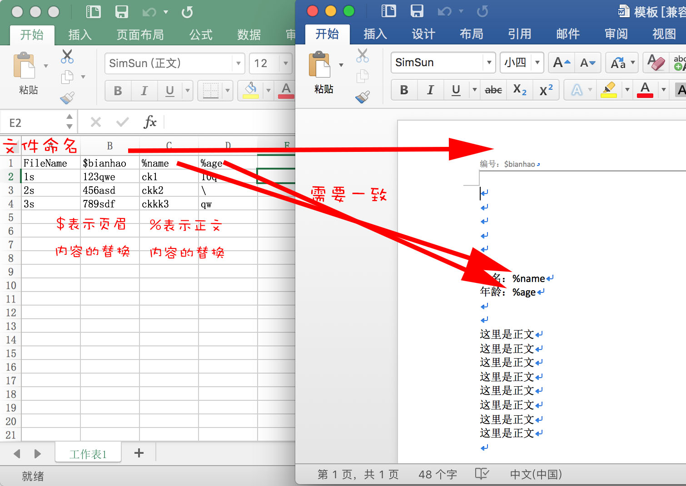

# CreatDocFromExcel
根据特定格式和内容的Excel(xls格式)和Word(doc格式)批量生成Word文档(doc格式)


###运行环境：
JAVA

###使用方法：
>jar可执行文件目录:out/artifacts/PoiOperation_jar/PoiOperation.jar


特定格式的Excel和word：



运行：


```bash
java PoiOperation.jar -jar
```
*注意word文件格式必须为doc，表格必须为xls*
*xls表格内的内容必须为文字，不能为纯数字*
生成的doc文件在jar文件相同目录下

